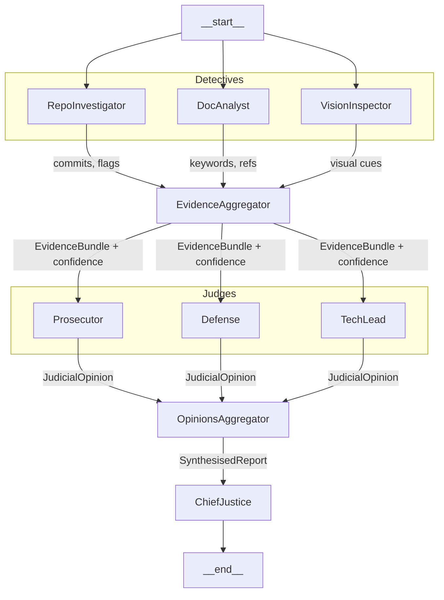

# Automation Auditor

[](https://github.com/nuhaminae/Automation-Auditor/actions/workflows/CI.yml)


## Project Overview

**Automation Auditor** is an AI “courtroom” designed to evaluate the quality of automation projects, pass judgement, and provide actionable feedback for improvement. It uses a structured framework to analyse repositories and reports, identify strengths and weaknesses, and offer recommendations for enhancement. The system is organised into three layers: **Detectives** (data gathering), **Judges** (evaluation), and the **Chief Justice** (synthesis).

This final submission demonstrates the complete pipeline. Detectives collect evidence in parallel, Judges deliberate with distinct philosophies, and the Chief Justice applies deterministic rules to synthesise a verdict. The output is a structured audit report in both Markdown and JSON formats, with remediation guidance.

---

## Key Features

- **Detective Nodes**  
  - **RepoInvestigator**: Clones the repository, extracts commit history, analyses orchestration in `src/graph.py`, and enriches evidence with GitHub API data.  
  - **DocAnalyst**: Ingests the PDF report, chunks text, searches for rubric concepts (Dialectical Synthesis, Fan‑In/Fan‑Out, Metacognition), and cross‑references file paths.  
  - **VisionInspector**: Extracts figures from the PDF and scans the repository for images, contributing to diagram analysis.  

- **Judges**  
  - **Prosecutor**: Critical lens, penalises flaws and orchestration gaps.  
  - **Defence**: Optimistic lens, highlights creativity and intent.  
  - **Tech Lead**: Pragmatic lens, focuses on technical viability and maintainability.  

- **Chief Justice**  
  - Synthesises conflicting opinions using deterministic rules defined in `rubric.json`.  
  - Applies overrides for security flaws, prioritises detective facts, and ensures dissent summaries where variance is significant.  
  - Produces a structured `AuditReport` with scores, remediation, and collaboration analysis.  

- **StateGraph Orchestration**  
  - Detectives run in parallel (fan‑out) and converge at the EvidenceAggregator (fan‑in).  
  - Judges deliberate in parallel and converge at the OpinionsAggregator.  
  - Chief Justice synthesises into the final report.  

- **Structured Outputs**  
  - All nodes return validated Pydantic models (`Evidence`, `JudicialOpinion`, `CriterionResult`, `AuditReport`).  
  - Reports are generated in Markdown and JSON formats, ensuring both human readability and machine consumption.  

- **Testing**  
  - `tests/test_doc_tools.py` validates PDF ingestion, chunking, keyword search, and cross‑referencing.  
  - `tests/test_repo_tools.py` validates repository cloning, commit history extraction, graph analysis, and GitHub API integration.  
  - These tests ensure safe tool engineering and report accuracy.  

---

## Table of Contents

- [Automation Auditor](#automation-auditor)
  - [Project Overview](#project-overview)
  - [Key Features](#key-features)
  - [Table of Contents](#table-of-contents)
  - [Project Structure](#project-structure)
  - [Installation](#installation)
    - [Prerequisites](#prerequisites)
    - [Setup](#setup)
  - [Usage](#usage)
  - [Orchestration Diagram](#orchestration-diagram)
  - [Project Status](#project-status)

---

## Project Structure

```bash
AUTOMATION-AUDITOR/
├── .github/                         # GitHub metadata
│   └── workflows/                   # CI/CD workflows
│   │   └── CI.yml
│   └── copilot-instructions.md      # MCP instructions for GitHub Copilot
├── .venv/                           # Virtual environment (not committed)
├── .vscode/
│   └── mcp.json                     # MCP configuration for VSCode Copilot
├── audit/                           # Automation audit reports
│   ├── report_onself_generated.md 
│   ├── report_onpeer_generated.md
│   └── report_bypeer_received.pdf              
├── reports/                         # Generated reports
│   ├── final_report.pdf             
│   └── interim_report.pdf           
├── rubrics/
│   └── rubric.json                  # Rubric defining evaluation criteria
├── src/                             # Script
│   ├── nodes/                       # Nodes for detectives, judges, and chief justice
│   │   ├── detectives.py           
│   │   ├── judges.py                
│   │   └── chief_justice.py         
│   ├── tools/                       # Tools for data processing and analysis  
│   │   ├── __init__.py
│   │   ├── doc_tools.py             
│   │   └── repo_tools.py            
│   │   └── vision_tools.py          
│   ├── __init__.py
│   ├── graph.py                     # StateGraph definition and orchestration logic
│   ├── main.py                      # Entry point for running the workflow
│   └── state.py                     # State management and evidence aggregation logic
├── tests/                           # Test suite for tools
│   ├── __init__.py
│   ├── test_doc_tools.py            
│   ├── test_dummy.py                # Placeholder test file
│   └── test_repo_tools.py           
├── .env                             # Environment variables (not committed)
├── .env.example                     # Example environment variables
├── .flake8                          # Flake8 configuration
├── .gitignore                       # Git ignore rules 
├── .pre-commit-config.yaml          # Pre-commit hooks configuration  
├── .yamllint.yml                    # YAML linting configuration
├── format.ps1                       # PowerShell script for code formatting
├── pyproject.toml                   # Dependency and tool configuration
├── README.md                        # Project overview
└── uv.lock                          # Dependency lock file
```

---

## Installation

### Prerequisites

- Python 3.9+  
- Git  

### Setup

```bash
# Clone repo
git clone https://github.com/nuhaminae/Automation-Auditor.git
cd Automation-Auditor

# Install dependencies
pip install uv
uv sync

```

---

## Usage

```bash
# For Ollama users,
# If not already running, start the Ollama server in a separate terminal
ollama serve
```

Run the partial audit workflow with:

```bash
python -m src/main.py <repo_url> <pdf_path> <rubric_path> [output_path]
```

- **Input**:  
  - `repo_url`: GitHub repository to audit
  - `pdf_path`: Path to the PDF report local or git  (e.g., `reports/interim_report.pdf`, or `https://raw.githubusercontent.com/nuhaminae/Automation-Auditor/main/reports/interim_report.pdf`)
  - `rubric_path`: Path to the rubric JSON file local or git (e.g., `rubrics/rubric.json` or `https://raw.githubusercontent.com/nuhaminae/Automation-Auditor/main/rubrics/rubric.json`)
  - `output_path` (optional): Path to save judgement report in both MD and json (e.g., `reports/verdict_report`)

- **Output**:  
  - A **Report** containing evidence collected by Detectives, Judges opinions, and Chief Justice synthesis.
  - The report is printed in Markdown format to the console and optionally saved to a file if `output_path` is provided.  

---

## Orchestration Diagram



---

## Project Status

The project is completed. Check the [commit history](https://github.com/nuhaminae/Automation-Auditor/).
