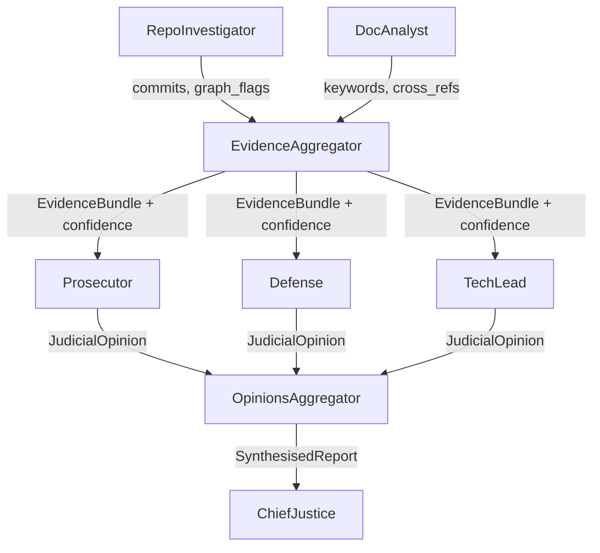

# Automation Auditor

[](https://github.com/nuhaminae/Automation-Auditor/actions/workflows/CI.yml)


## Project Overview

**Automation Auditor** is an AI "courtroom" designed to evaluate the quality of automation, pass judgement, and provide actionable feedback for improvement. It uses a structured framework to analyse automation scripts, identify strengths and weaknesses, and offer recommendations for enhancement. It has three layers: Detectives (data gathering), Judges (evaluation), and Chief Justice (synthesis).

This interim submission demonstrates the Detective Layer, with RepoInvestigator and DocAnalyst running in parallel (fan‑out) and converging at EvidenceAggregator (fan‑in). Judges and Chief Justice nodes will be added in the final submission.

---

## Table of Contents

- [Automation Auditor](#automation-auditor)
  - [Project Overview](#project-overview)
  - [Table of Contents](#table-of-contents)
  - [Key Features](#key-features)
  - [Project Structure](#project-structure)
  - [Installation](#installation)
    - [Prerequisites](#prerequisites)
    - [Setup](#setup)
  - [Usage](#usage)
  - [Project Status](#project-status)

---

## Key Features

- **Detective Nodes**  
  - **RepoInvestigator**: Clones the repository, extracts commit history, and analyses orchestration in `src/graph.py`.  
  - **DocAnalyst**: Ingests the PDF report, chunks text, searches for rubric concepts (Fan‑In/Fan‑Out, Dialectical Synthesis), and cross‑references file paths.  

- **Evidence Aggregation**  
  - Evidence from both detectives is collected at the **EvidenceAggregator** node.  
  - This demonstrates **fan‑out/fan‑in orchestration**, a core rubric requirement.  

- **Partial StateGraph**  
  - Only Detectives + EvidenceAggregator are wired.  
  - Judges and Chief Justice will be added in the final submission.  

---

## Project Structure

```bash
AUTOMATION-AUDITOR/
├── .github/                         # GitHub metadata
│   └── workflows/                   # CI/CD workflows
│   │   └── CI.yml
│   └── copilot-instructions.md      # MCP instructions for GitHub Copilot
├── .venv/                           # Virtual environment (not committed)
├── .vscode/
│   └── mcp.json
├── reports/
│   ├── final_verdict.json           # Final judgement report (to be generated)
│   └── interim_report.pdf           # Interim report document
├── rubrics/
│   └── rubric.json                  # Rubric defining evaluation criteria
├── src/                             # Script
│   ├── nodes/
│   │   └── detectives.py            # Node definitions for detectiive layer
│   ├── tools/
│   │   ├── __init__.py
│   │   ├── doc_tools.py             # Tools for document processing
│   │   └── repo_tools.py            # Tools for repository analysis
│   ├── __init__.py
│   ├── graph.py                     # StateGraph definition and orchestration logic
│   ├── main.py                      # Entry point for running the workflow
│   └── state.py                     # State management and evidence aggregation logic
├── tests/                           # Test suite
│   ├── __init__.py
│   ├── test_doc_tools.py            # Tests for document processing tools
│   ├── test_dummy.py                # Placeholder test file
│   └── test_repo_tools.py           # Tests for repository analysis tools
├── .env                             # Environment variables (not committed)
├── .env.example                     # Example environment variables
├── .flake8                          # Flake8 configuration
├── .gitignore                       # Git ignore rules 
├── .pre-commit-config.yaml          # Pre-commit hooks configuration  
├── .yamllint.yml                    # YAML linting configuration
├── format.ps1                       # PowerShell script for code formatting
├── pyproject.toml                   # Dependency and tool configuration
├── README.md                        # Project overview
└── uv.lock                          # Dependency lock file
```

---

## Installation

### Prerequisites

- Python 3.9+  
- Git  

### Setup

```bash
# Clone repo
git clone https://github.com/nuhaminae/Automation-Auditor.git
cd Automation-Auditor

# Install dependencies
pip install uv
uv sync

```

---

## Usage

```bash
# For Ollama users,
# If not already running, start the Ollama server in a separate terminal
ollama serve
```

Run the partial audit workflow with:

```bash
python -m src/main.py <repo_url> <pdf_path> <rubric_path> [output_path]
```

- **Input**:  
  - `repo_url`: GitHub repository to audit
  - `pdf_path`: Path to the PDF report local or git  (e.g., `reports/interim_report.pdf`, or `https://raw.githubusercontent.com/nuhaminae/Automation-Auditor/main/reports/interim_report.pdf`)
  - `rubric_path`: Path to the rubric JSON file local or git (e.g., `rubrics/rubric.json` or `https://raw.githubusercontent.com/nuhaminae/Automation-Auditor/main/rubrics/rubric.json`)
  - `output_path` (optional): Path to save judgement report (e.g., `reports/verdict_report.json`)

- **Output**:  
  - A **Report** containing evidence collected by Detectives, Judges opinions, and Chief Justice synthesis.  

---

## Project Status

The current submission demonstrates Detectives wired in parallel (fan‑out) and converging at EvidenceAggregator (fan‑in).



The project is still on going. Check the [commit history](https://github.com/nuhaminae/Automation-Auditor/).
