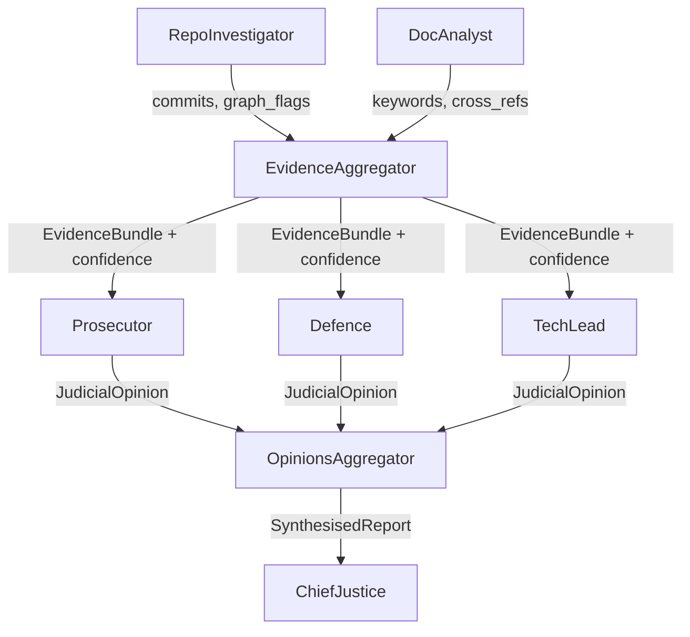

# Interim Submission Report – Automation Auditor

The **Automation Auditor** project has reached the interim stage, where the primary focus has been on constructing a partial StateGraph that demonstrates the detective layer of the courtroom framework. At this stage, the system successfully wires the `RepoInvestigator` and `DocAnalyst` nodes in parallel, allowing them to run concurrently in a fan‑out pattern. Their findings are then collected by the `EvidenceAggregator` node, which represents the fan‑in stage of the graph. This orchestration satisfies the rubric requirement for demonstrating parallel execution and aggregation of evidence.

The `RepoInvestigator` node is responsible for cloning the target repository, extracting its commit history, and analysing the orchestration logic within the graph file. This ensures that the system can provide forensic insights into the evolution and structure of the codebase. In parallel, the `DocAnalyst` node ingests the PDF report using Docling, chunks the document into manageable sections, searches for key rubric concepts such as Dialectical Synthesis and Fan‑In/Fan‑Out, and cross‑references file paths mentioned in the report against those found in the repository. Together, these detectives provide a balanced view of both the code and its documentation, ensuring that evidence is gathered from multiple sources. The `EvidenceAggregator` node plays a crucial role in merging the outputs of the detectives. Although the aggregation logic is minimal at this stage, the reducers defined in the AgentState ensure that evidence objects are appended safely without overwriting one another. This design demonstrates the robustness of the state management system and prepares the groundwork for more complex aggregation in later stages.

Several architecture decisions have been made to support this design.

- Firstly, the project uses **Pydantic models** rather than plain dictionaries for state definitions. This choice enforces type safety, improves validation, and ensures that evidence and opinions are appended consistently without risk of schema drift.
- Secondly, **AST parsing** was selected as the method for analysing orchestration logic within the repository. This approach provides a structured and reliable way to inspect the graph file, rather than relying on brittle string matching.
- Finally, the **sandboxing strategy** for repository cloning ensures that forensic analysis is performed in isolation, protecting the integrity of the host environment and avoiding unintended side‑effects. These decisions reflect a deliberate emphasis on rigour, reproducibility, and forensic soundness.

There are, however, known gaps in the current implementation. The **judicial layer** has not yet been added, meaning that the collected evidence is not subjected to structured debate or technical assessment. Similarly, the synthesis engine, represented by the Chief Justice node, is absent, so no final `AuditReport` is produced. The concrete plan for addressing these gaps involves introducing three judge nodes: the **Prosecutor**, who will argue against the quality of automation; the **Defence**, who will argue in favour; and the **Tech Lead**, who will provide a technical assessment. These judges will run in parallel, and their opinions will be collected by an `OpinionsAggregator` node. Finally, the **Chief Justice** node will act as the synthesis engine, combining the judicial opinions into a coherent and actionable `AuditReport`. This synthesis will not simply aggregate opinions but will weigh them according to confidence scores, rationale, and relevance to rubric dimensions. The Chief Justice will resolve conflicts between judges by applying dialectical reasoning, ensuring that the final report presents a balanced view. The outcome will be a structured verdict that highlights critical issues, acknowledges strengths, and provides clear recommendations for improvement. This ensures that the `AuditReport` is both comprehensive and practical, guiding future enhancements to automation quality.

The planned StateGraph flow can be visualised as follows:

This diagram shows the current detective fan‑out/fan‑in pattern, followed by the planned judicial fan‑out/fan‑in and final synthesis. It illustrates how the project will evolve from the interim submission to the complete courtroom pipeline.

The project is on track, with the next milestone being the addition of two nodes to get a complete graph. The focus will be on ensuring that the judges can effectively process the collected evidence and that the Chief Justice can synthesise their opinions into a coherent and actionable `AuditReport`.
